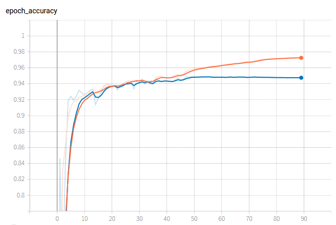
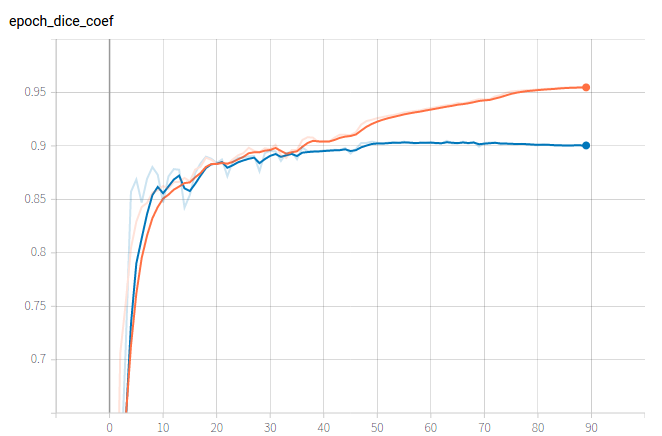
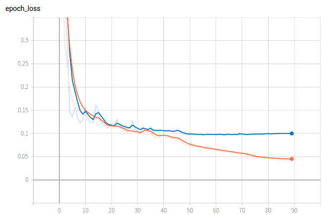
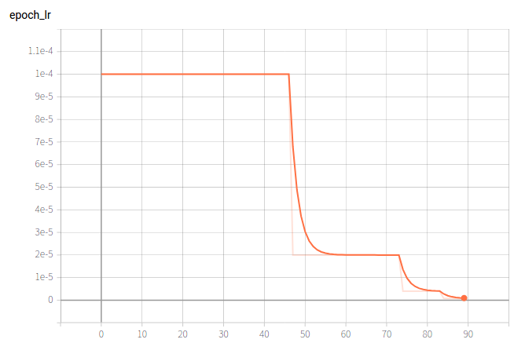

# Improved Uneter
Student ID:46179605
Student Name:JINGXU

## 1. Requirements   
```bash
tensorflow>=2.2
scikit-learn
numpy
cv2
``` 

## 2. Algorithm Description   
We use the Unet model to classify the ISIC data set, and separate the skin lesions by identifying pictures. The architecture was inspired by [U-Net: Convolutional Networks for Biomedical Image Segmentation](http://lmb.informatik.uni-freiburg.de/people/ronneber/u-net/).  
The model is used to automatically predict the segmentation boundary of skin lesions. In the end, we hope that the trained model can separate the lesion area by recognizing the picture, and the classification accuracy can exceed 0.8.
### Model
 
 The above is the original model structure proposed in the paper. On the basis of the original model, I modified the four copy and crop and added a 2x2 convolution layer. Using ISIC2016 data set for training, dice loss is used as the loss function, and dice similarity coefficient is used as the evaluation standard. The score of 0.88 is achieved in ISIC16 test set.

### DataSet
The [Data](https://challenge2018.isic-archive.com/) we load in is the 256*256 pictures. We divide the training set and the test set into 9 to 1.

### Result
Here are the test results
From left to right are test.jpg pre.jpg mask.jpg
 
Here's the visualization.




 


## 3. Train
1. Download the dataset and unzip it under datasets
```
wget https://isic-challenge-data.s3.amazonaws.com/2016/ISBI2016_ISIC_Part1_Training_Data.zip
wget https://isic-challenge-data.s3.amazonaws.com/2016/ISBI2016_ISIC_Part1_Training_GroundTruth.zip
wget https://isic-challenge-data.s3.amazonaws.com/2016/ISBI2016_ISIC_Part1_Training_GroundTruth.zip
wget https://isic-challenge-data.s3.amazonaws.com/2016/ISBI2016_ISIC_Part1_Test_GroundTruth.zip
```
2. Install the libraries necessary to run the code
3. 
```
python train.py --batch_size 16 --data_dir datasets --workers 8 --epochs 100 --lr 0.0001 --logs ./logs 
```
## 4. test
Test model performance on isic2016 and Dice similarity coefficient
```
python test.py --data_dir datasets --model weight/best.ckpt
```
If you don’t want to train the model from scratch, you can download my trained model from [here] (fill in the model link)

If you want to see the model effect more intuitively
```
python pre.py --pre_dir test --model weight/best.ckpt --out testout
```
This will input the images in the test into the model, and convert the output into images and store them in the testout
